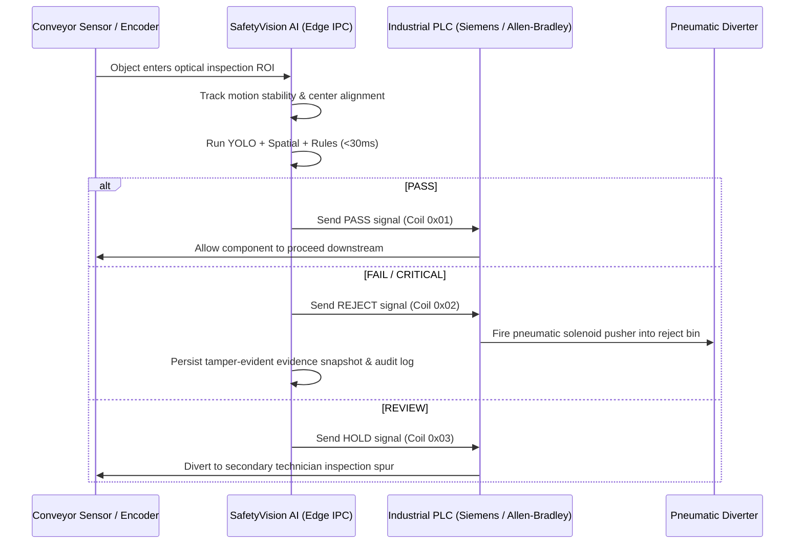

# SafetyVision AI — Production Roadmap & Edge Deployment Architecture

## 1. Production Architecture Overview

The transition from this Day 1 Prototype to a 24/7 automated plant installation involves three distinct evolutionary phases:

```
+-----------------------------------------------------------------------------------+
| PROTOTYPE (Today)       -> PILOT (Field Trials)        -> PRODUCTION (24/7 Plant) |
| Local Workstation / Web   Edge Box / Single Station      Multi-Line Industrial AI |
+-----------------------------------------------------------------------------------+
```

### Complete End-to-End Industrial Architecture

```
[Industrial GigE Vision / IP Camera]
       ↓ (GenICam / RTSP Stream)
[Industrial Edge AI Computer (NVIDIA Jetson / Advantech IPC)]
       ↓ (Hardware-Accelerated Decoding: NVDEC)
[TensorRT / ONNX Inference Engine (<15ms)]
       ↓
[Multi-Object Tracker (ByteTrack / BoT-SORT)]
       ↓
[Spatial Reasoning & ROI Centering Trigger (app/roi.py)]
       ↓
[Deterministic Safety Rule Engine (app/rules.py)]
       ↓
[Local SQLite / Time-Series Database Sync]
       ↓
       ├─────────────────────────────────────────┐
       v                                         v
[Factory PLC / Fieldbus]                 [Cloud / MES / SCADA]
- OPC-UA / Modbus TCP                    - Enterprise Fleet Dashboard
- 24V Digital I/O Reject Arm             - Historical Failure Trend Analytics
- High-Speed Diverter Solenoid           - Automated Work-Order Tagout Generation
```

---

## 2. Hardware Specification Recommendations

### Edge AI Computers
1. **Tier 1 (High-Volume Conveyor Lines)**:
   - **NVIDIA Jetson AGX Orin Industrial** (64GB RAM, 275 TOPS, Conformal Coated, -40°C to 85°C operation).
   - Capable of running multiple concurrent 60 FPS vision inspection streams with TensorRT FP16/INT8.
2. **Tier 2 (Operator Bench Stations)**:
   - **NVIDIA Jetson Orin Nano** (8GB, 40 TOPS) or **Advantech MIC-770 V2 Industrial PC**.
   - DIN-rail or VESA mountable at workstation.

### Industrial Optical Sensors & Cameras
1. **GigE Vision Cameras**:
   - Basler ace 2 / FLIR Blackfly S (GigE POE, Sony Pregius Global Shutter CMOS).
   - Global shutter is mandatory to prevent rolling shutter distortion on moving parts.
2. **Optics & Illumination**:
   - Polarized telecentric lenses to eliminate barrel distortion and metallic glare.
   - High-intensity diffuse ring lights or structured line lasers.

---

## 3. Conveyor Integration & High-Speed Reject Logic

The architecture is prepared for inline conveyor inspection via `app/roi.py` and `app/integrations/plc.py`:



---

## 4. Multi-Equipment Scalability

Adding new equipment categories (e.g., bench grinders, drill presses, circular saws) requires **no core code changes**:
1. Add equipment class in `config/classes.yaml`.
2. Define mandatory components and damage rules in `config/safety_rules.yaml`.
3. Train model on augmented images.
4. The rule engine, spatial analyzer, evidence generator, and UI automatically adopt the new specification.
